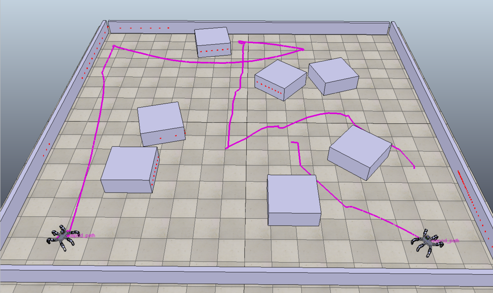

# Mobile robot exploration


## Introduction

The project was developed for the [Artificial Intelligence in Robotics course](https://cw.fel.cvut.cz/b231/courses/uir/start). It provides the solution for autonomous robotic exploration, connecting to the CoppeliaSim simulator to navigate the robot(s) through the environment, avoid collisions, and collect metric maps. The success metric is the environment coverage percentage achieved in a given time frame. Key features included mapping with occupancy maps, frontier detection using multiple methods (such as Free-edge cluster frontiers and Mutual information at frontiers), and planning strategies like closest frontier, highest utility, and Traveling Salesman Problem (TSP) solutions. Additionally, the project involved both fully centralized and decentralized multi-robot exploration strategies with interprocess communication.



## Implemented Approaches

### 1. Mapping
- **Representation:** Probabilistic occupancy grid map.
- **Update:** Fusion of laser scan data into the current state of the map.

### 2. Frontier Detection and Planning
- **Exploration Type 1:** Detection based on segmented free-edge cells, followed by sorting of clusters for planning.
- **Exploration Type 2:** Frontier selection based on mutual information calculation.
- **Exploration Type 3:** Goals selected as a solution of the TSP.

### 3. Multi-Robot Exploration
- **Without Interprocess Communication:** Centralized system for mapping and path planning.
- **With Interprocess Communication:** Decentralized decision-making using TCP socket communication.

## Features for Robustness

- **Continuous Collision Monitoring:** Bresenham’s algorithm used to monitor the path for collisions.
- **Goal Frontier Presence Monitoring:** Continuous checking for the presence of selected frontiers.

## How to Run the Project

1. **Environment Setup:** Developed on Ubuntu 22.04, Python 3.10. Use `requirements.txt` or create a Conda environment with `environment.yml`.
2. **CoppeliaSim Setup:**  First setup the Coppelia environment 

```bash
~/CoppeliaSim_Edu_V4_6_0_rev16_Ubuntu22_04/coppeliaSim.sh
```

The GUI window launches. Choose the correct scene: `File` -> `Open scene` -> `/mobile-robot-exploration/vrep_scenes/blocks_multirobot.ttt`

3. **Run Explorer.py:**
```
python Explorer.py [−p { 1 , 2 , 3 } ] [−m] ID
```
- `-p`: Exploration type (default is 1).
- `-m`: For multi-robot decentralised exploration with interprocess communication.
- `ID`: Robot's ID (starting from 0).
4. **Run MultiExplorer.py for centralized control:**
```
python MultiExplorer.py 
```

